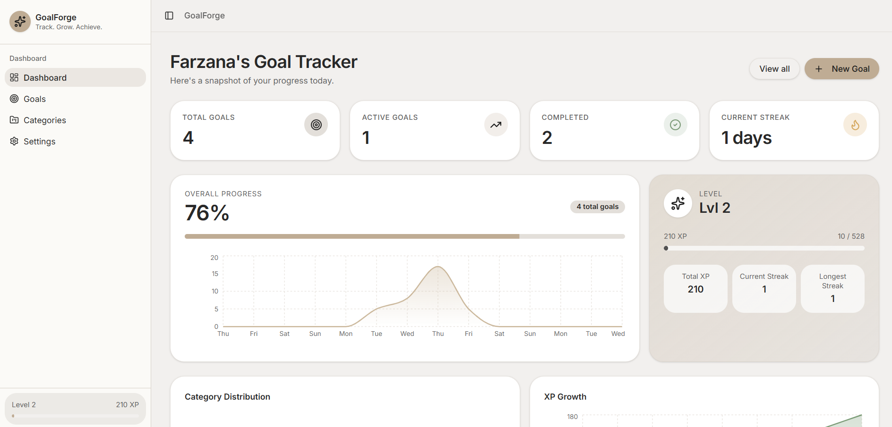
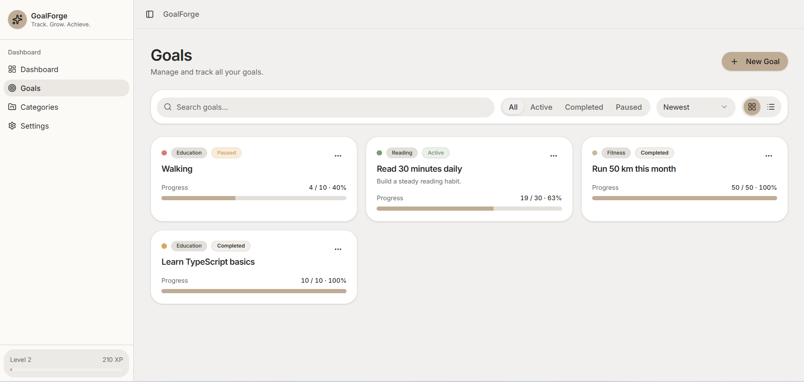
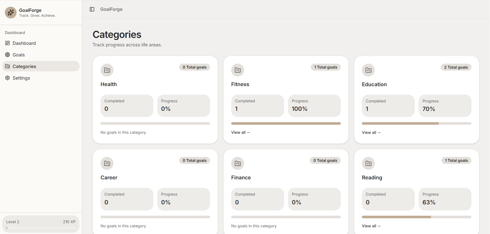
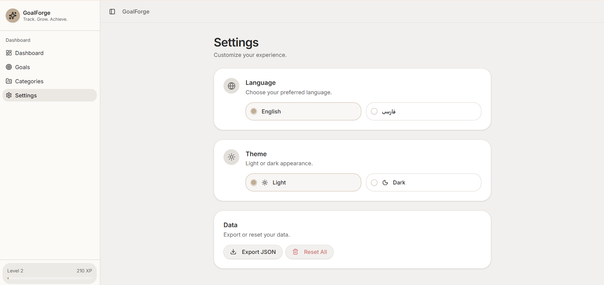

# Goal Tracker Dashboard

## Repository

GitHub: https://github.com/Farzana921/goal-traker-

Developed by: Farzana

## Project Overview

Goal Tracker Dashboard is a React web application that helps users create goals, track progress, monitor streaks, earn XP, and manage achievements. The application supports multiple languages with RTL/LTR switching and provides a responsive user experience for desktop and mobile devices.

## Technologies Used

* React
* Vite
* TypeScript
* TanStack Router
* Tailwind CSS
* Recharts
* LocalStorage

## Features Checklist

### Dashboard

*  Overall completion percentage
*  Active goals summary
*  Completed goals summary
*  XP tracking
*  Streak tracking
*  Progress charts
*  Achievement badges

### Goal Management

*  Create goal
*  View goals
*  Edit goal
*  Delete goal
*  Pause/Resume goal
*  Mark goal progress

### Categories

*  Category overview
*  Category statistics
*  Progress visualization

### Settings

*  Language switch
*  RTL/LTR support
*  Theme settings

### Data Persistence

*  LocalStorage support

## XP Rules

* Each progress entry grants 20 XP.
* Completing a goal grants additional XP.
* XP contributes to user level progression.

## Streak Rules

* A streak increases when progress is logged on consecutive days.
* Missing a day resets the streak.
* Longest streak is stored and displayed on the dashboard.

## RTL / LTR Support

The application supports English and Persian with automatic RTL/LTR layout switching.

* English → Left-to-Right (LTR)
* Persian → Right-to-Left (RTL)

The layout direction changes automatically when the language is switched.

## How to Run

1. Clone the repository
2. Install dependencies

npm install

3. Start development server

npm run dev

4. Open the provided local URL in your browser

## Screenshots

### Dashboard

### Goals Page

### Categories Page

### Settings Page

## Author

Farzana
Week 6 Assignment – Goal Tracker Dashboard
